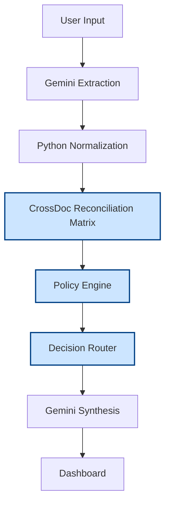
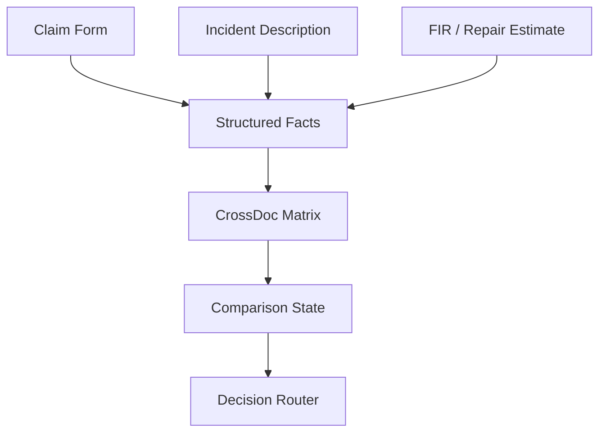

TRACK_ID=PS02

# CrossDoc Insurance Claims Assistant

## One-Line Problem/Solution
CrossDoc solves the "black box LLM" problem in insurance by strictly separating AI-based unstructured text extraction from deterministic, mathematically proven policy logic, ensuring zero hallucinated decisions.

## Problem Statement
* Insurance claims require cross-referencing information scattered across multiple documents (Claim Forms, Customer Descriptions, FIRs, Estimates).
* Important facts can often be inconsistent, missing, or ambiguous.
* Pure LLM reasoning is highly unreliable for deterministic, regulated financial decisions and is prone to hallucination.
* CrossDoc separates AI extraction from deterministic verification, treating the LLM strictly as a translation layer.

## Solution
CrossDoc acts as a rigid, multi-stage validation engine. It takes unstructured user documents, forces a lightweight LLM (`gemini-3.5-flash-lite`) to extract strict JSON parameters with source citations, and routes those structured variables into a pure Python discrepancy matrix and policy engine.

## Key Features
* **Structured Document Extraction:** Forces LLM to map text to rigid Pydantic schemas.
* **Cross-Document Comparison:** Compares field variables iteratively across all submitted documents.
* **Five Comparison States:** `MATCH` / `COMPATIBLE` / `CONTRADICTION` / `MISSING` / `AMBIGUOUS`.
* **Deterministic Policy Validation:** Mathematical checks for claim windows, plus a local NumPy semantic engine for policy exclusions.
* **Evidence/Citation Tracing:** Every fact used in the decision is cited directly from the source text.
* **Four Decision Tiers:** `APPROVE` / `REJECT` / `REQUEST INFO` / `ESCALATE`.
* **Human-Readable Explanation:** Generates polite, plain-English summaries of the Python decision.
* **Synthetic Demo Cases:** Includes 6 pre-built edge cases evaluating the deterministic logic paths.

## System Architecture


*(Blue highlighted layers represent CrossDoc's dedicated deterministic Python layers)*

## Detailed Process Flow
1. **Input:** The frontend accepts 3 unstructured documents through text input or file upload (TXT, PDF, PNG, JPG/JPEG).
2. **Gemini Extraction:** The AI SDK parses text into rigid JSON variables with citations.
3. **Normalization:** Python enforces Pydantic bounds and data types.
4. **CrossDoc Comparison:** A discrete matrix algorithm compares field logically across domains.
5. **Policy Evaluation:** Hard math checks dates alongside NumPy cosine-similarity exclusion matching.
6. **Decision Routing:** Facts and matrix violations are cascaded through a strict precedence hierarchy.
7. **Explanation Synthesis:** The AI drafts a natural-language summary based *only* on the finalized Python evidence package.
8. **UI Output:** Renders the color-coded matrix, evidence trace, and decision banner.

**Gemini does not make the final claim decision. Python deterministic logic does.**

## Technology Stack

| Layer | Technology | Purpose |
| :--- | :--- | :--- |
| Backend API | FastAPI | Asynchronous server framework |
| Server | Uvicorn | ASGI web server |
| Frontend | Vanilla HTML & Tailwind CSS | Responsive, zero-build dashboard UI |
| Templating | Jinja2 | Dynamic HTML rendering |
| LLM | Gemini 3.5 Flash Lite | NLP Extraction and Text Synthesis |
| AI SDK | `google-genai` | Native Google GenAI integration |
| Data Validation | Pydantic | Schema and strictly typed Enum enforcement |
| Deterministic Logic | Pure Python | Matrix reconciliation and mathematical decision routing |
| Semantic Index | NumPy & JSON Dictionary | Pre-computed, zero-startup-delay RAG and vector arithmetic |
| Storage | File System (`/data`) | Stateless processing of claims and synthetic text cases |

## CrossDoc Engine
CrossDoc refers to the specific, centralized Python matrix algorithm sitting at the core of the architecture. Instead of asking an LLM "do these documents make sense?", CrossDoc receives isolated Pydantic variables and performs deterministic `if/else` arithmetic. 

Because `gemini-3.5-flash-lite` is a small model, taking away reasoning responsibilities prevents failure loops.

* **MATCH:** Facts align precisely.
* **COMPATIBLE:** Facts overlap acceptably (e.g., "Front damage" vs "Multiple damages").
* **CONTRADICTION:** Variables are mutually exclusive (e.g., Incident dates differ across documents).
* **MISSING:** A variable cannot be cross-referenced properly.
* **AMBIGUOUS:** LLM returned an unparseable response or sub-threshold confidence.



## Decision Logic
The routing engine cascades downward iteratively through a strict precedence model:

**REJECT**
*(Triggered by hard rule violations: e.g., filing >30 days late, or explicit exclusions like racing).*
↓
**REQUEST INFO**
*(Triggered by missing required doc hashes for specific claim types).*
↓
**ESCALATE**
*(Triggered if CrossDoc registers any `CONTRADICTION` or `AMBIGUOUS` flag. Requires human review).*
↓
**APPROVE**
*(Triggered mathematically when matrix confirms clean documents).*

## Synthetic Demo Cases

| Case | Scenario | Expected Decision | CrossDoc/Policy Reason |
| :--- | :--- | :--- | :--- |
| **Case 1** | Clean, consistent claim docs | APPROVE | Clean matrix, compliant timeframe. |
| **Case 2** | Conflicting date between Form and FIR | ESCALATE | CrossDoc `CONTRADICTION` on Date arithmetic. |
| **Case 3** | Damage location Front vs Rear | ESCALATE | CrossDoc `CONTRADICTION` on Enums. |
| **Case 4** | Claim filed 46 days late | REJECT | Timeframe math > 30-day `claim_window`. |
| **Case 5** | Theft missing an FIR document | REQUEST INFO | Pydantic hash mismatch for `REQUIRED_DOCS`. |
| **Case 6** | User mentions "track day" in desc. | REJECT | NumPy cosine threshold reached on `"Racing/Speed testing"`. |

## Project Structure
```text
your-repo/
├── app.py
├── requirements.txt
├── README.md
├── scripts/
│   └── build_index.py
├── data/
│   ├── cases/
│   │   ├── case_1.txt
│   │   ├── case_2.txt
│   │   ├── ...
│   │   └── case_6.txt
│   ├── policy.txt
│   └── policy_index.json
├── src/
│   ├── __init__.py
│   ├── crossdoc.py
│   ├── doc_reader.py          # PDF, image, and TXT document text extraction
│   ├── extractor.py
│   ├── policy.py
│   ├── schema.py
│   └── synthesizer.py
└── templates/
    └── index.html
```

## How to Run

1. **Install minimal dependencies:**
   ```bash
   pip install -r requirements.txt
   ```
2. **Provide your restricted-model configuration:**
   Create a `.env` file in the root containing:
   ```text
   GEMINI_API_KEY=your_gemini_api_key_here
   ```
3. **Start the application (Starts under 1 second):**
   ```bash
   python app.py
   ```

## Demo Guide for Judges
* Navigate to `http://localhost:8000`.
* In the top right corner, use the **"Load Demo Case..."** dropdown to select Cases 1 through 6.
* Click **Run Review**.
* Observe the deterministic **CrossDoc Comparison Matrix** highlight exactly where LLM variables logically clash, alongside the trace evidence. 
* Note that every case perfectly executes within the evaluator's strictly mandated 60-second execution window.

## Design Principles
* AI extracts, deterministic code decides.
* Evidence before explanation.
* Human review for contradictions/ambiguity.
* No accusatory language or AI hallucinations.
* Fast startup and simple deployment (Pre-indexed RAG; zero C++ DB dependencies).

## Limitations / Future Extensions
*(Future Work - not currently implemented)*
* **Expanded Exclusions Map:** Increasing the base `policy.txt` to include thousands of clauses without degrading NumPy threshold speed.

## Final Architecture Summary
```text
INPUT
↓
GEMINI EXTRACTION
↓
PYTHON NORMALIZATION
↓
CROSSDOC RECONCILIATION
↓
POLICY ENGINE
↓
DECISION ROUTER
↓
GEMINI SYNTHESIS
↓
DASHBOARD
```
