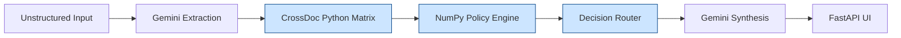

# CrossDoc Insurance Claims Assistant

**Track:** PS02

An evidence-grounded, ultra-fast insurance claims review assistant engineered to eliminate LLM hallucinations by separating AI text-parsing from hard mathematical decision-making.

---

## ⚠️ The Problem

Insurance claims require cross-referencing information scattered across multiple documents (Claim Forms, Customer Descriptions, FIRs, Estimates). Pure LLM reasoning is highly unreliable for deterministic, regulated financial decisions and is prone to hallucination.

## 💡 The Solution

CrossDoc acts as a rigid, multi-stage validation engine. It uses a lightweight LLM (`gemini-3.5-flash-lite`) purely as an NLP translation layer to extract strict JSON parameters. Those structured variables are then routed into a **deterministic Python discrepancy matrix and policy engine** that computes the final claim outcome.

> **Gemini does not make the final claim decision — Python math does.**

## ✨ Key Features

- **Structured Document Extraction** — Forces the LLM to map unstructured text to rigid Pydantic schemas.
- **Deterministic Policy Validation** — Mathematical checks for date windows, plus a local NumPy-based semantic engine for policy exclusions (zero startup delay).
- **Evidence Tracing** — Every fact used in the decision is cited directly from the source text.
- **Human-Readable Synthesis** — AI drafts a polite, plain-English summary of the Python decision.
- **Zero C++ Dependencies** — Avoids heavy FAISS/ChromaDB builds entirely for maximum portability.

## 🏗️ Architecture & Processing Flow



**Flow:** Frontend Input → AI extracts JSON variables → Python bounds checks → CrossDoc compares field overlap across documents → Policy checks math/exclusions → Decisions are cascaded → Output is synthesized for the UI.

## 🛠️ Technology Stack

| Layer            | Technology                            | Purpose                                          |
|------------------|----------------------------------------|---------------------------------------------------|
| API & Server     | FastAPI, Uvicorn                       | High-performance ASGI web server                  |
| Frontend         | HTML, Tailwind, Jinja2                 | Responsive, zero-build dashboard UI               |
| LLM & SDK        | gemini-3.5-flash-lite, google-genai    | Restricted small-model parsing and synthesis      |
| Data Validation  | Pydantic                               | Strict schema and Enum enforcement                |
| Logic Engine     | Pure Python                            | Matrix reconciliation and decision routing        |
| Semantic Index   | NumPy & JSON                           | Pre-computed, zero-delay policy limit RAG         |

## 🧠 Deterministic Decision Logic

Once facts are extracted, the pure Python routing engine cascades downward through a strict precedence model based on the matrix results:

1. **REJECT** — Hard rule violations (e.g., filed >30 days late, explicit racing exclusions).
2. **REQUEST INFO** — Missing mandatory document hashes (e.g., FIR missing for theft).
3. **ESCALATE** — The CrossDoc matrix detects a CONTRADICTION (mutually exclusive facts) or AMBIGUOUS flag across the documents. Requires human review.
4. **APPROVE** — Clean matrix, compliant timeframe, no exclusions.

## 🧪 Synthetic Demo Cases

| Case   | Scenario                          | Expected Decision | Python Route Trigger                              |
|--------|------------------------------------|--------------------|-----------------------------------------------------|
| Case 1 | Clean, consistent claim docs       | APPROVE            | Clean matrix, compliant timeframe.                  |
| Case 2 | Conflicting date (Form vs FIR)     | ESCALATE           | CrossDoc date arithmetic CONTRADICTION.             |
| Case 3 | Damage location Front vs Rear      | ESCALATE           | CrossDoc categorical Enum CONTRADICTION.            |
| Case 4 | Claim filed 46 days late           | REJECT             | Timeframe math > 30-day `claim_window`.             |
| Case 5 | Theft missing an FIR document      | REQUEST INFO       | Pydantic hash missing in `REQUIRED_DOCS`.           |
| Case 6 | User mentions "track day"          | REJECT             | NumPy cosine threshold reached on exclusions.       |

## 📁 Project Structure

```
your-repo/
├── app.py                   # FastAPI application entry
├── requirements.txt         # Verified SDK dependencies
├── README.md
├── scripts/
│   └── build_index.py       # Pre-embeds policy rules statically
├── data/
│   ├── cases/                # Synthetic text edge cases
│   └── policy_index.json     # Pre-computed NumPy database
├── src/
│   ├── extractor.py          # LLM -> JSON parsing logic
│   ├── crossdoc.py           # Discrepancy matrix (the core engine)
│   ├── policy.py              # Precedence routing / dates / NumPy RAG
│   ├── schema.py              # Pydantic interfaces
│   └── synthesizer.py         # LLM Python-to-paragraph engine
└── templates/
    └── index.html             # Full HTML/Tailwind dashboard UI
```

## 🚀 How to Run

```bash
# 1. Install dependencies
pip install -r requirements.txt

# 2. Add your Gemini API key (creates a .env file, already in .gitignore)
echo "GEMINI_API_KEY=your_gemini_api_key_here" > .env

# 3. Start the server (starts instantly)
python app.py

# 4. Open the demo
#    http://localhost:8000
#    Use the dropdown in the top right to load and run Cases 1-6
```
